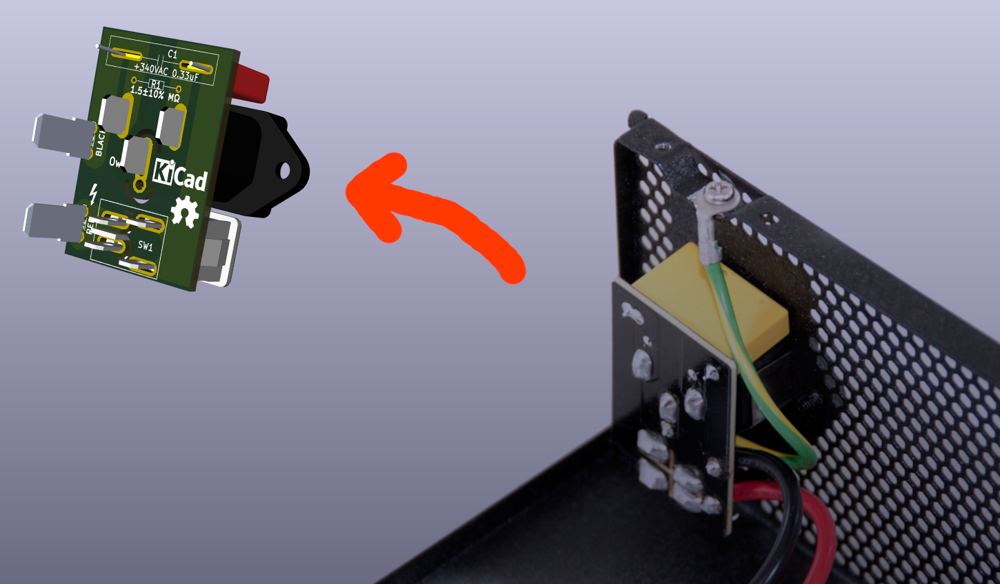

# EVGA SUPERNOVA 1000 G2 Input Power Daughter Board

**REVERSE-ENGINEERED, NOT AN OFFICIAL PRODUCT**

Context: I got this PSU 2nd hand and noticed that it's filled with dust for me to fully disassemble it and clean it to then also notice that the daughter board has it's layer separated in a way that risks connection between the two VAC phases to desolder it and make a new one for me and for people who are in similar situation.

Electronics breakdown: https://www.techpowerup.com/review/evga-supernova-g2-1000/4.html

## SAFETY WARNING

Turning off the power switch **IS NOT ENOUGH TO CUT POWER TO THE RELEVANT COMPONENT**, it only cuts power to one phase, but **THE OTHER PHASE GOES SOMEWHERE IN THE MAINBOARD AND __IS LIVE WITH UP TO 240 VOLTS 10 AMPS ALTERNATE CURRENT, MORE THAN ENOUGH TO KILL YOU OR CAUSE YOU SERIOUS INJURY__!**.

**ALWAYS DISCONNECT FROM POWER AND VERIFY THAT THE POWER SUPPLY IS NOT LIVE WITH APPROPRIATE EQUIPMENT** e.g. CAT III multimeter **__WITH LEADS CERTIFIED ON 240V 10 AMPS ALTERNATE CURRENT__** as the mainboard has a large capacitors **WHICH COULD ELECTROCUTE YOU**.

**ALWAYS PERFORM MAINTANANCE ON THE DEVICE UNDER QUALIFIED SUPERVISION** ideally professional who is certified to provide first aid to electrocuted patients and thus capable of saving your life, as **IN CASE OF AN ELECTROCUTION YOU WILL NEED A DEFIBRILATOR __GENERIC FIRST AID AND HEART MASSAGE IS NOT ENOUGH TO SAVE YOUR LIFE AFTER ELECTROCUTION__** as if current goes through your heart muscles there is a high risk of the current causing the muscles to beat out of sync causing your heart to be unable to oxygenate your blood.

### Additional Notes

EVGA uses film capacitor with wrong rating (305VAC) while the Root Mean Square for 240VAC input power is is 340VAC, thus it's recommended to get an alternative capacitor with sufficient rating.

### Credits

QR Code Generated via https://github.com/lyqht/mini-qr, thanks!
