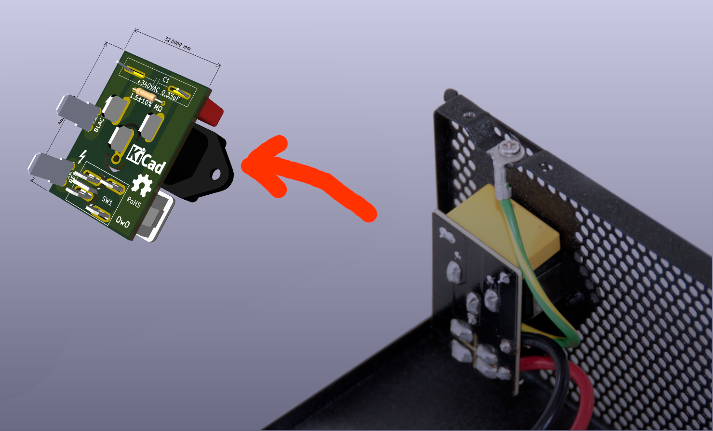

# EVGA SUPERNOVA 1000 G2 Input Power Daughter Board

**REVERSE-ENGINEERED, NOT AN OFFICIAL PRODUCT**

Context: I got this PSU 2nd hand and noticed that it's filled with dust for me to fully disassemble it and clean it to then also notice that the daughter board has it's layer separated in a way that risks connection between the two VAC phases to desolder it and make a new one for me and for people who are in similar situation.

Electronics breakdown: https://www.techpowerup.com/review/evga-supernova-g2-1000/4.html

### Additional Notes

EVGA uses film capacitor with wrong rating (305VAC) while the Root Mean Square for 240VAC input power is is 340VAC, thus it's recommended to get an alternative capacitor with sufficient rating.
